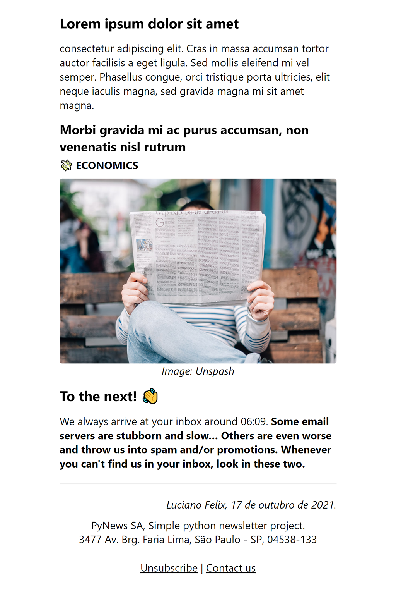

<h1 align="center">PyNews 📰</h1>
<p align="center">
  Simple newsletter made with python
</p>



## Install dependencies

This project has some dependencies (see [`requirements.txt`](requirements.txt)) that are not included in the standard python library, so it is necessary to install them with the following command:

```bash
pip install -r requirements.txt
```

## Configuration

The `config.json` (at project root) file contains essential  definitions be for sending  and some optional properties for templating. Because this file may contain sensitive information it is ignored, so it needs to be created manually at installation.

```json
{
  "transport": {
    "mail": "mail@example.com",
    "smtp": "smtp.gmail.com",
    "port": 456
  },
  "props": {
    "author": "John Doe"
  }
}
```

To fill the transport configuration, search for [*list of SMTP servers*](https://www.google.com/search?q=List+of+SMTP+servers) and select the one that matches your email.

## Template properties

Prop can be declared either in `config.json` or in the meta at the top of the file to be used later in writing using the property name in curly braces.

```md
place: my house

# Who made this?
Mabe by {author} at {place}.
```

## Subscribers list

The `subscribers.txt` (at project root) file contains the list of emails from subscribers to your newsletter that will receive in their inboxes when the newsletter is sent. Because this file may contain sensitive information it is ignored, so it needs to be created manually at installation.

```txt
mail@example.com
othermail@example.com
...
```

## Build for preview

Running the python file in `scripts/build.py` runs the process to build your newsletter HTML code. It also opens it in the web browser so you can see the final result that will be sent to the inboxes.

```bash
$ python scripts/build.py
> Opening preview...
```


## Send newsletter

Running the python file in `scripts/send.py` runs the build process in tandem with the newsteller's send process for the inboxes. So, in addition to opening the web browser so you can see the final result, confirm whether you want to send the newsletter and ask for the transport email account access password and then dispatch for the inboxes.

```bash
$ python scripts/send.py
> Opening preview...
> Send? (yes/no) yes
> E-mail password:
> Login successfully!
> Sending 1 of 32...
...
> Newsletter launched successfully!
```

## License
This project is [MIT licensed](https://github.com/FelixLuciano/PyNews/blob/main/LICENSE).
