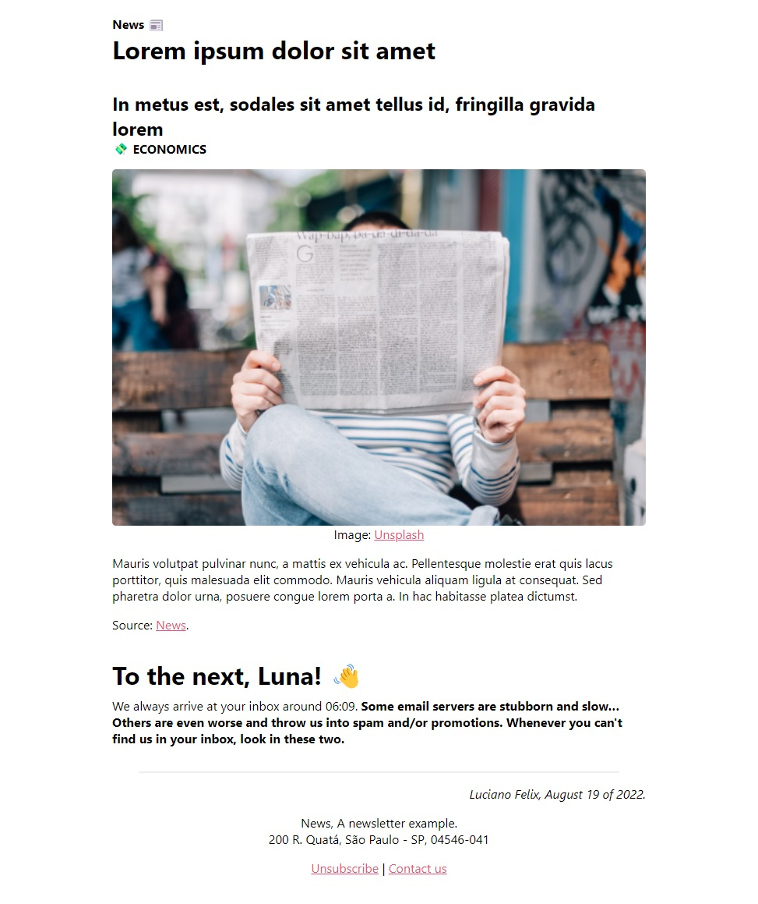

<h1 align="center">Pypers 📰</h1>
<p align="center">
  Mail templating and sending with Jupyter
</p>
<p align="center">
  
</p>


## VS Code workspace

This project was designed to be used as a Workspace for VS Code. So in addition to containing tools that will help the use, it is essential that Jupyter is used for VS Code for the tool to work!


## Authentication

In order to send the pages by Gmail or fetch data from Google Sheets, Google Cloud credentials are required for authentication in this project.

See the [Getting started with authentication](https://cloud.google.com/docs/authentication/getting-started) for Google Cloud API. Then put your key at `[PROJECT FOLDER]/credentials.json`. and it's ready to use!


## Install dependencies

This project has some dependencies (see [`requirements.txt`](requirements.txt)) that are not included in the standard python library, so it is necessary to install them runnung the following command:

```bash
pip install .
```


## License
This project is [MIT licensed](https://github.com/FelixLuciano/Pypers/blob/main/LICENSE).
